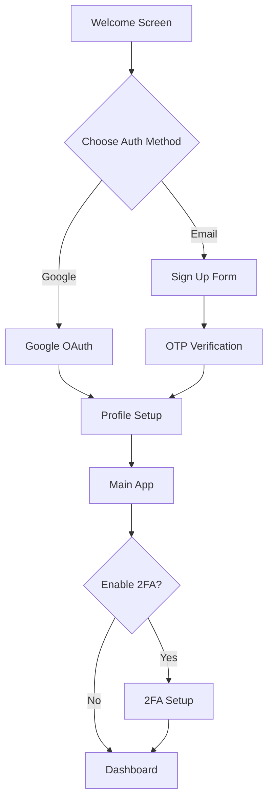

# 🍽️ AFRI-Plates Mobile App

**Discover Authentic Cameroonian Cuisine on Your Mobile Device**

A React Native mobile application built with Expo that brings the rich flavors and cultural heritage of Cameroon to your fingertips. AFRI-Plates features authentic recipes, cultural stories, and AI-powered cooking assistance.


## ✨ Features

### 🔐 **Enhanced Authentication**
- **Email & Password** signup with OTP verification
- **Google OAuth** integration for quick onboarding
- **Two-Factor Authentication (2FA)** with TOTP support
- **Role-Based Access Control (RBAC)** - User, Chef, Admin roles
- **Secure Password Reset** with email verification

### 🎯 **Core Features**
- **Recipe Discovery** - Browse authentic Cameroonian recipes
- **AI Assistant** - Voice-powered cooking guidance with VAPI integration
- **Ingredient Scanner** - Identify ingredients using camera
- **Meal Planning** - Weekly meal planning with shopping lists
- **Regional Cuisine** - Explore recipes by Cameroon regions and tribes
- **Social Features** - Follow chefs, save favorites, reviews & ratings
- **Cultural Content** - Learn about Cameroonian food culture

### 🎨 **User Experience**
- **Dark/Light Theme** with automatic switching
- **Cultural Design** - Cameroon-inspired colors and patterns
- **Offline Support** - Access saved recipes without internet
- **Push Notifications** - Recipe updates and cooking reminders
- **Multi-language Support** - English and French

## 🚀 Quick Start

### Prerequisites

- **Node.js** 18.0 or higher
- **npm** or **yarn**
- **Expo CLI** (`npm install -g @expo/cli`)
- **Android Studio** (for Android development)
- **Xcode** (for iOS development - macOS only)

### Installation

1. **Clone the repository**
   ```bash
   git clone https://github.com/yourusername/afri-plates-mobile.git
   cd afri-plates-mobile/clients/mobile-users
   ```

2. **Install dependencies**
   ```bash
   npm install
   ```

3. **Setup Environment Variables**

   Create a `.env` file in the root directory:
   ```env
   # Supabase Configuration
   EXPO_PUBLIC_SUPABASE_URL=your_supabase_project_url
   EXPO_PUBLIC_SUPABASE_ANON_KEY=your_supabase_anon_key
   
   # Google OAuth (optional)
   EXPO_PUBLIC_GOOGLE_CLIENT_ID=your_google_client_id
   
   # VAPI AI Assistant (optional)
   EXPO_PUBLIC_VAPI_API_KEY=your_vapi_api_key
   ```

   **⚠️ Security Note**: Never commit your `.env` file to version control!

4. **Configure Supabase**

   Update `lib/supabase.ts` with your actual Supabase credentials:
   ```typescript
   const supabaseUrl = process.env.EXPO_PUBLIC_SUPABASE_URL || 'YOUR_SUPABASE_URL';
   const supabaseAnonKey = process.env.EXPO_PUBLIC_SUPABASE_ANON_KEY || 'YOUR_SUPABASE_ANON_KEY';
   ```

5. **Start the development server**
   ```bash
   npx expo start
   ```

6. **Run on device/simulator**
   - **iOS**: Press `i` in the terminal or scan QR code with Expo Go
   - **Android**: Press `a` in the terminal or scan QR code with Expo Go
   - **Web**: Press `w` in the terminal

## 🏗️ Architecture

### Authentication Flow


### App Structure
```
├── 🔐 Authentication Layer
│   ├── Supabase Auth + RBAC
│   ├── Google OAuth Integration
│   ├── OTP Verification
│   └── Two-Factor Authentication
│
├── 📱 Core Screens
│   ├── Home & Discovery
│   ├── Recipe Details & Cooking Mode
│   ├── AI Assistant & Scanner
│   ├── Profile & Settings
│   └── Social Features
│
├── 🎨 UI Components
│   ├── Themed Components
│   ├── Cultural Design Elements
│   ├── Reusable Forms
│   └── Navigation Components
│
└── 🔧 Services
    ├── Supabase Client
    ├── Push Notifications
    ├── AI Integration
    └── Storage Management
```

## 🔧 Configuration

### Supabase Setup

1. **Create a Supabase project** at [supabase.com](https://supabase.com)

2. **Enable Authentication providers** in Supabase Dashboard:
   - Go to Authentication > Providers
   - Enable Email and Google OAuth
   - Configure Google OAuth with your client credentials

3. **Set up Multi-Factor Authentication**:
   - Go to Authentication > Settings
   - Enable MFA/TOTP
   - Configure your app's redirect URLs

4. **Database Schema** (will be provided separately):
   - User profiles and preferences
   - Recipe and chef data
   - Reviews and favorites
   - Regional and cultural content

### Google OAuth Setup

1. **Google Cloud Console**:
   - Create a project
   - Enable Google+ API
   - Create OAuth 2.0 credentials
   - Add your app's bundle ID and SHA-1 fingerprint

2. **Configure deep linking** in `app.json`:
   ```json
   {
     "expo": {
       "scheme": "afriplates",
       "plugins": [
         "@react-native-async-storage/async-storage"
       ]
     }
   }
   ```

## 📱 Screen Navigation

### Authentication Flow
- **WelcomeScreen** - App introduction and onboarding
- **SignUpScreen** - Email signup with Google OAuth option
- **LoginScreen** - User sign-in with 2FA support
- **ForgotPasswordScreen** - Password recovery
- **TwoFactorSetupScreen** - TOTP configuration

### Main App Flow
- **HomeScreen** - Featured recipes and recommendations
- **SearchScreen** - Recipe search with advanced filters
- **RecipeDetailScreen** - Full recipe view with cooking mode
- **AIAssistantScreen** - Voice cooking guidance
- **ScannerScreen** - Ingredient recognition
- **ProfileScreen** - User profile and settings
- **MealPlannerScreen** - Weekly meal planning

## 🔐 Security Features

### Authentication Security
- **Supabase Row Level Security (RLS)** for data protection
- **JWT token management** with automatic refresh
- **Two-Factor Authentication** using TOTP
- **Secure password requirements** and validation
- **OAuth 2.0** integration with Google

### Data Protection
- **Environment variable encryption**
- **Sensitive data exclusion** from Git
- **Secure API communication** with HTTPS
- **User data anonymization** options

## 🎨 Theming & Customization

### Cultural Design
The app incorporates Cameroonian cultural elements:
- **Color palette** inspired by the Cameroon flag and traditional patterns
- **Regional themes** for different Cameroon provinces
- **Cultural symbols** and traditional design motifs
- **Typography** that reflects cultural heritage

### Theme Configuration
```typescript
// Colors inspired by Cameroonian culture
export const Colors = {
  light: {
    primary: '#228B22',    // Green from flag
    secondary: '#FFD700',  // Gold accents
    accent: '#DC143C',     // Red from flag
    background: '#FFFFFF',
    text: '#2F4F4F',
  },
  dark: {
    primary: '#32CD32',
    secondary: '#FFD700',
    accent: '#FF6B6B',
    background: '#1A1A1A',
    text: '#FFFFFF',
  }
};
```

## 🧪 Testing

### Running Tests
```bash
# Unit tests
npm run test

# E2E tests (requires setup)
npm run test:e2e

# Test coverage
npm run test:coverage
```

### Test Structure
- **Unit tests** for utilities and components
- **Integration tests** for authentication flow
- **E2E tests** for critical user journeys
- **Accessibility tests** for inclusive design

## 📦 Build & Deployment

### Development Build
```bash
# Build for development
npx expo run:android
npx expo run:ios
```

### Production Build
```bash
# Build for production
eas build --platform all
```

### App Store Deployment
```bash
# Submit to app stores
eas submit --platform all
```

## 🤝 Contributing

We welcome contributions to make AFRI-Plates even better!

### Development Workflow
1. Fork the repository
2. Create a feature branch (`git checkout -b feature/amazing-feature`)
3. Commit your changes (`git commit -m 'Add amazing feature'`)
4. Push to the branch (`git push origin feature/amazing-feature`)
5. Open a Pull Request

### Code Standards
- **TypeScript** for type safety
- **ESLint + Prettier** for code formatting
- **Conventional Commits** for commit messages
- **Component documentation** with JSDoc

## 📚 Documentation

### API Documentation
- [Supabase Documentation](https://supabase.com/docs)
- [Expo Documentation](https://docs.expo.dev)
- [React Native Documentation](https://reactnative.dev/docs)

### Project Documentation
- [Authentication Guide](./docs/authentication.md)
- [Theming Guide](./docs/theming.md)
- [API Integration](./docs/api-integration.md)
- [Deployment Guide](./docs/deployment.md)

## 🐛 Troubleshooting

### Common Issues

**Expo Metro bundler issues:**
```bash
npx expo start --clear
```

**iOS build errors:**
```bash
cd ios && pod install
```

**Android gradle issues:**
```bash
cd android && ./gradlew clean
```

**Supabase connection issues:**
- Verify your environment variables
- Check network connectivity
- Confirm Supabase project status

## 📄 License

This project is licensed under the MIT License - see the [LICENSE](LICENSE) file for details.

## 🙏 Acknowledgments

- **Cameroon culinary experts** for authentic recipes
- **Open source community** for amazing tools
- **Beta testers** for valuable feedback
- **Cultural consultants** for authenticity guidance

## 📞 Support

### Get Help
- **GitHub Issues** - Report bugs and request features
- **Discord Community** - Join our developer community
- **Email Support** - contact@afri-plates.com

### Project Status
- **Version**: 1.0.0 (MVP)
- **Status**: Active Development
- **Last Updated**: December 2024

---

**Made with ❤️ for the Cameroonian diaspora and food lovers worldwide**

*Bringing authentic Cameroonian cuisine to your mobile device, one recipe at a time.*